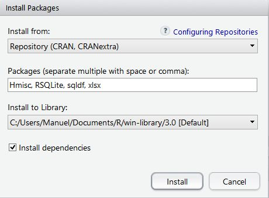

# Setting everything up {#setup}

## Project structure

In order to set all the required files and project, the reader should create a directory that contains the following elements.

 - **R** folder: The code is stored in this folder.
    - *ADPP.R*: R script that contains all the required functions to process accelerometry data.
    - *MARA_ac_protocol.R*: R script that contains all the pipe for processing acelerometry data.
 - **data** folder: Contains all the .agd files to be processed.
 - **output** folder: The final data frame and a log will be stored in this folder.

## Required packages {#requiredPackages}

In R, *Packages* are collections of R functions, data, and compiled code in a well-defined format. In order to execute the code, some packages are required and must be downloaded, installed and loaded prior to running the code.

The required packages are:

- `chron`
- `Hmisc`
- `RSQLite`
- `sqldf`
- `xlsx`

To install any package, you can use the built-in function:

    install.packages(<package_name>)

Or, if you decided to install RStudio, this IDE provides easy tool to automatically download and install multiple packages at the same time. Under the Packages tab (bottom-right panel), you can see all your installed packages. There, you can use the "Install package" button to download and install the required packages. Figure \@ref(fig:installPack) image presents this dialog.

```{r installPack, fig.cap='Install package dialog', out.width='50%', fig.asp=.75, fig.align='center',echo = FALSE}

```

